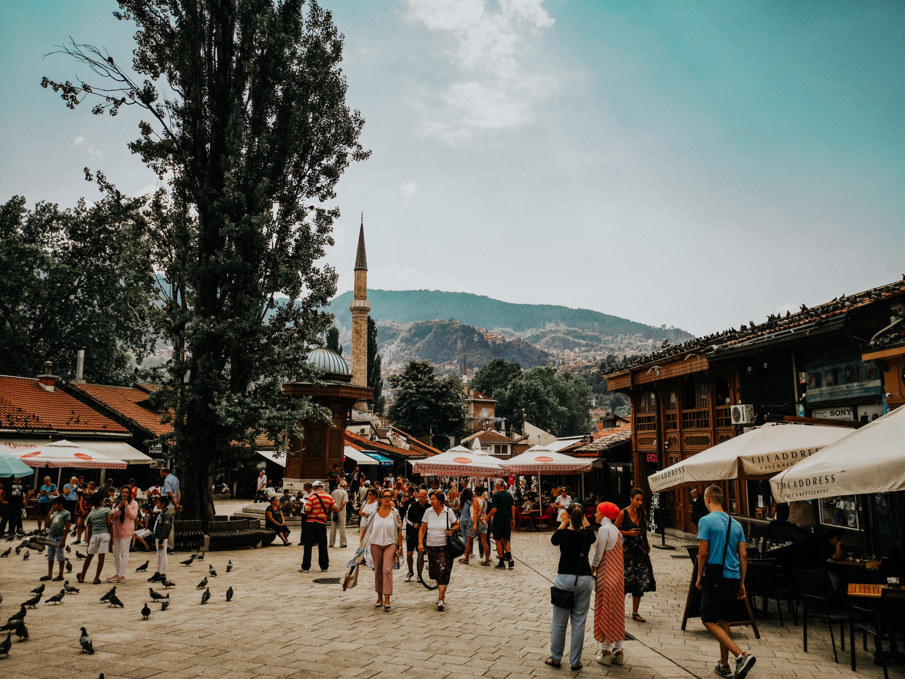

Photo by <a href="https://unsplash.com/@x3me">ADEV</a> on <a href="https://unsplash.com/@x3me">Unsplash</a>

_“Many educated, intelligent people in Sarajevo, as elsewhere in Yugoslavia (and, for that matter, all over Europe), felt they were ‘betwixt and between,’ hung in space, more or less frustrated, momentarily uncertain of their future; while I — with my ‘success’ in America, my ability to return there whenever I liked, my Guggenheim Fellowship, and my American citizenship which protected me against anyone in Yugoslavia who might wish to put me in prison for political reasons — was good luck and romance personified.”_ — Adamic, Louis, 1899–1951. The Native’s Return: An American Immigrant Visits Yugoslavia and Discovers His Old Country (Kindle Locations 2752–2756). New York London, Harper & brothers.

Recently I’ve been reading books by authors who have emigrated to the US and then became successful writers in their acquired English language. I’ve been living in the US for the last three years, and I wanted to explore what it takes to be a successful immigrant writer. Then, over the weekend, I discovered _The Native’s Return: An American Immigrant Visits Yugoslavia and Discovers His Old Country_ by Louis Adamic (Slovene: Alojz Adamič) (1898–1951). Adamic was a native Slovenian who emigrated to the USA when he was 15. At the time, _The Native’s Return_ became a bestseller in the US.

The book is a hybrid of a travelogue and social and political commentary of Yugoslavia in 1932. After 19 years of emigrant life, Adamic came back to Yugoslavia with his wife, Stella. The book was published in 1934, but because it was directed against King Alexander’s (Adamic meets the king in the final chapter of the book) regime, it was quickly banned in the Kingdom of Yugoslavia. The book is available on Internet Archive for free and can be downloaded in various formats <pPhoto href="https://archive.org/details/nativesreturname00adam_0/mode/2up" target="_blank">here</pPhoto>. All quotes in this article can be found in the book, pg. <a href="https://archive.org/details/nativesreturname00adam_0/page/178/mode/2up">178–202</a>.

A little note about Yugoslavia: Yugoslavia was a country of my parents, a federation of six republics that disbanded in the early 1990s, resulting in a horrible war in Bosnia. I was born in 1992, just a couple of weeks after Bosnian citizens voted to separate from Yugoslavia.

## Sarajevo in the 1930s

Personally, the most interesting and engaging chapter in _The Native’s Return_ was _A City Suspended in Space_, where Adamic describes his visit to Sarajevo, a town where I was born and grew up. I was interested in finding out first-hand what Sarajevo was like in the 1930s. Adamics came to Sarajevo in mid-December of 1932 on a train from Dubrovnik. On their first morning in Sarajevo, they awoke at daybreak and, for the first time, heard a call for prayer. Back then, Sarajevo had ninety-nine mosques, and one could hear a call for prayer five times every day. Things haven’t changed much since then, except that today there are approximately 125 mosques in Sarajevo. I believe that the imam from the mosque I attended as a kid still has the most beautiful voice, rich with melody and dramatic tremor, and when I would hear his call to prayer, my desire to pray increased. I needed this push for the morning prayer, which happens just before sunrise. As a kid, and especially in my teenage years, I hated getting up early (summers were particularly hard because the sunrise occurred at 5 am). On the mornings when imam’s voice wasn’t enough, mom would jump in and make sure I was up and praying.

Getting up early to pray is a challenge for many Muslims; that’s why the words “Essalatu hayrun minen-nevm” are added to the call for morning prayer. This phrase means, “Prayer is better than sleep.” When I became a Latter-day Saint, I found the same principle in the following verse: “retire to thy bed early, that ye may not be weary; arise early, that your bodies and your minds may be invigorated.” (Doctrine and Covenants 88:124). No matter what religion, getting up early to exert mental capacities is hard!

Immediately after describing the call for prayer, Adamic writes something unique to Sarajevo and Bosnia: “This was the Orient. By a freak of history, here in Slavic Bosnia, was this westernmost outpost of the East; an island of Islam within a sea of Christianity, almost no farther from Berlin or Paris than from Constantinople (Istanbul) or Angora (Ankara).” The fact that I was a Slavic Muslim has left many Westerners — ignorant about Bosnian history (and the history of Europe) — wondering how I could come from a Muslim family and be white. Then I would follow the well-practiced script and explain that Bosnia used to be a Christian country until the mid-15th century when Ottomans conquered it and brought Islam. My story would culminate with the Bosnian War of the 1990s, when Slavic Muslims were under the threat of extinction because Serbian nationalists sought to “ethnically cleanse” Bosnia from Islam.

## Finding Gavrilo Princip’s Bridge

The first place Adamic wanted to visit in Sarajevo was marked by the actions of a different type of nationalist, Gavrilo Princip. On June 28, 1914, near the northern edge of Latin Bridge, 19-year old Princip shot and killed Franz Ferdinand, heir presumptive to the Austro-Hungarian throne. After World War II until the Bosnian War, Latin Bridge was renamed to Princip Bridge, and had the following inscription: “From this place, on June 28, 1914, Gavrilo Princip with his shooting expressed the people’s protest against tyranny and centuries-long aspiration of our people for freedom.” If you visit the bridge today, you will find an apolitical plaque that reads: “From this place on 28 June 1914, Gavrilo Princip assassinated the heir to the Austro-Hungarian throne Franz Ferdinand and his wife, Sofia.” Regardless of how the inscription has evolved along with ruling political ideologies, this event triggered World War I, charting the course for the 20th century.

Adamics couldn’t find the bridge, so they stopped a young man, who “while buttoned up in an elegant English overcoat, wore a red fez tilted at a rakish angle on the right side of his head so that the tassel dangled over his ear; and, explaining to him that we were strangers in Sarajevo, asked if he could point out to us the historic bridge.” This young man was Omar Hadji Alic (Bosnian: Hadži Alić), a son of the local antique store owner. Omar was fascinated by America, and he learned from the newspapers that Adamic would be visiting Yugoslavia. For the next three weeks, Omar was the Adamics tourist guide.

## Omar and I

Through Omar’s conversations with Adamics, I found many similarities between Omar and me. For Omar, as it is for me, Sarajevo is personally and historically an ironic town. Personally, we both loved it but at the same time, felt trapped, suspended in space. Historically, to paraphrase Omar, Sarajevo is ironic because many world-changing events occurred here, yet Sarajevo was the same as it was in 1914. These transforming events include the World War I, which caused changes that brought Bolsheviks to power in Russia, fascism to Italy, broke up Austria, Hitler came to power in Germany, and Kemal Pasha in Turkey.

Furthermore, Islam in Sarajevo is too far from the East, but never entirely accepted and integrated by the West. Slavic Muslims are essentially Westerners, with fundamentally eastern religion. Both Omar and I were unhappy in Sarajevo, because although we were so close to the West, we “are terribly far away from the rest of the world, from the vital processes of culture, civilization, progress.” This unhappiness turned into anxiety and probably some depression two times in my life, when I came back from Sweden after playing soccer for three months, and after coming back from my two-year mission in the UK. After visiting these Western countries, I felt trapped back in Bosnia — with no opportunities and no freedom to explore the world. I was also unhappy with the inertia around me. People were complaining about the situation in the country, but no one worked to bring changes. Everyone was waiting for something big to happen and deliver them from their misery.

When I visited Bosnia with Megan (my beautiful American wife) in February this year after two and a half years of living in the USA, many of my friends told never to come back to live in Bosnia permanently because nothing changes there. It was obvious that my friends felt trapped, working miserable jobs for a type of salary that sustains only bare survival. They considered me very lucky, and for them, I was romance personified. One of my unique traits in my community was not that I only emigrated to the USA, but that I was the first to marry an Amerikanka (an American woman).

Ironically, my wife and I are still planning to spend a couple of years in Bosnia. When we visited in February, we enjoyed spending time with family and close friends, and we felt that it would be fun and enriching to live there. I never traveled much around Bosnia except for soccer games, so I think there’s a lot I don’t know about my motherland. Both of us want to travel around the country, but also explore other ex-Yugoslavia countries. I’m particularly interested in Montenegro, where my ancestors came from sometimes in the early 1920s.

For the rest of their stay in Sarajevo, Omar takes Adamics to his family’s house, his father’s antique store, and finally brings them to a surprise party at the Anglo-American Club. The club’s primary purpose was the study of English and acquiring books from England and America. Adamic describes the party in the following way: “Some fifty persons were packed in two small rooms — young Moslems of Omar’s age, Orthodox Serbs, men and women, a half-dozen Jews, and two or three Catholics; business people, government clerks, journalists, teachers and students — all avidly, quaveringly interested in the United States, the world beyond the Sarajevo mountains, in American literature, art, films, music; social, racial, religious, and sex questions and problems; immigration, racketeering, labor, and politics — and in Stella and me personally. The party lasted all night. By the end of it, Stella and I were exhausted from answering their questions. When Omar succeeded in getting us back to the hotel, the muezzin was again calling his morning summons to prayer from the minaret of the near-by mosque.”

Despite the war that has divided the country and its ethnic groups, Sarajevo is still a multi-ethnic city, with Muslims, Catholics, Orthodox Christians, and Jews living together and supporting each other. These people look beyond ethnicity and unintelligent nationalism.

For Omar, America was significant because it opened a way to freedom from highly divided and messy Europe. For me, America is significant because people that helped me transform my life and my most incredible mentors and friends are Americans. Through friendships and mentoring, I completed my graduate education in the US and then obtained permanent residence. Although it’s evident that the US is changing and faced with many challenges, I still believe that this is a great nation and the only place where I feel that I’m reaching my full potential as a human being. Many immigrants and native Americans tend to criticize the US these days. However, I only have to remember that this land has given me freedom and prosperity and expanded my views. Ultimately, I don’t believe that life in the US is what many media outlets and politicians are these portraying it to be. Yes, challenges exist, but wouldn’t want to be anywhere else at this moment. I believe that to move forward we need to be honest to each other and build trust.

## Trust and Honesty

I might be oversimplifying, but this section in which Adamic’ describes store owner’s in Sarajevo is a great example of building trust and living peacefully among each other: “According to Omar, these men, Jews and Moslems alike, are all extremely honest. Honesty is not a mere policy with them; it’s in their blood. They trust one another and everybody else. When the muezzin calls to prayer the Moslems pull their legs from under themselves and, without so much as thinking to board and bolt up their shops, hurry off to the nearest mosque. ‘They believe,’ said Omar, ‘that while they pray to Allah, Allah protects their interests — and it seems to be true.’ Despite the widespread poverty, there is almost no thieving or other crime in Sarajevo.”

Finally, America is significant for me because the US forces ended the war in Bosnia after most of the Western world ignored the horrific bloodshed and inhumanity for three long years. The war that displaced my family. The war that raised me on powdered milk, bread, and water, and prevented me from tasting a banana until I was three. I wondered if Omar could have imagined the horrible war that would put Sarajevo under siege for over 1000 days. I also wonder if he ever ended up visiting the US.
