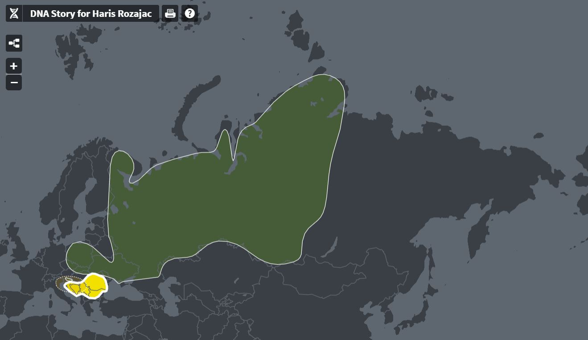
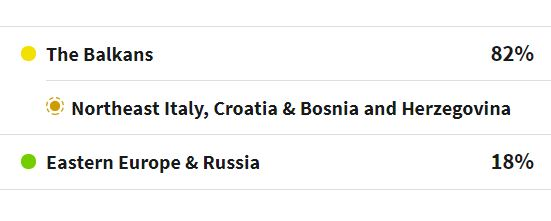
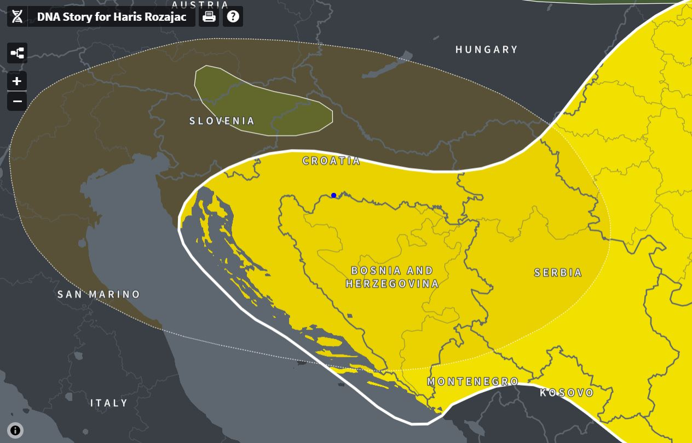

_Discovering my roots through a DNA analysis._

A couple weeks ago, I sent my DNA sample to <a href="https://www.ancestry.com/" target="_blank">Ancestry.com</a> for the ethnicity analysis. It cost me \$99 + shipping costs. I don't know anything about my family history beyond my great-grandparents because I couldn't find any records and my great-grandparents where too young when their parents died. I'm aware that DNA test doesn't provide a perfect picture of my family history, but it did give me a good idea where to look. Furthermore, it has connected me with some close and distant cousins that have profiles on Ancestry.

I'm really happy that I've gained a little more insight about my family history. Although Balkans were under the rule of Ottoman Empire and then Austro-Hungarian monarchy, it doesn't look like my ancestors carry any DNA from the centers of those Empires. I'm a 100% Slavic, and very much a <a href="https://www.youtube.com/watch?v=UIqzAZDpmtY" target="_blank">_Balkanero_</a>.

Here are the results.

### Ethnicity Estimate

### A Closer Look at Balkan Region

My main subgroup is North East Italy, Croatia & Bosnia and Herzegovina. The people in this area all lived and worked together for many generations. My mom told me that her ancestors were Italian miners, which makes sense because many Italians flocked to Fužine, Croatia in 1750s.

Furthermore, many Venetians lived in northern Croatia, and Croats traveled and traded with Venetians.

Ancestors on my dad's side were from Montenegro, and all I know about them that sometime in 1800s they came from Montenegro and settled in Bosnia. Their family name was Kajević, but under the threat of some kind of blood revenge, they changed their last name to Rožajac, after Rožaje - a town in Montenegro.

## Matching Family Names on Ancestry

#### Close relatives

After your DNA is analysed, Ancestry will match it with other people who have done the DNA test with Ancestry and created a profile. I've matched 29 people as close cousins (I share 20-111 <a href="https://en.wikipedia.org/wiki/Centimorgan#:~:text=In%20genetics%2C%20a%20centimorgan%20(abbreviated,a%20single%20generation%20is%200.01.">centimorgans</a> with these people). Here are their family names:

    1. Dedić
    2. Čučuković
    3. Muhdžahasić
    4. Višća
    5. Mahmutović
    6. Miljanić
    7. Andrić
    8. Andrić
    9. Ljubić
    10. Ramić
    11. Pašić
    12. Kekić
    13. Višća
    14. Babić
    15. Babić
    16. Hampton
    17. Imamović
    18. Rossi
    19. Perković
    20. Danović
    21. Popović
    22. Letić
    23. Danović
    24. Ninković
    25. Capaculovski
    26. Šabanović
    27. Tracy
    28. Gillespie
    29. Severdia

#### Distant relatives

I also share common DNA with 3,003 people on Ancestry. These people are considered distant cousins (5th to 8th cousin with 10-20 shared centimorgans). The family names in this group are mostly Serbian or Croatian, with some Italian.

    1. Mišković
    2. Stojanović
    3. Ivanović
    4. Borović
    5. Cehaja
    6. Jakupi
    7. Vuk
    8. Zrnić
    9. Petrović
    10. Macolino
    11. Šimić
    12. Đordev
    13. Vlaović
    14. Djurović
    15. Kolev
    16. Mihaljević
    17. Belčević
    18. Sačić
    19. Gottardi
    20. Galusić
    21. Stojanovski

My plan is to reach out to some of these people and gain further insights. My goal is to try to find maiden names from female members, because they mostly changed once these women were married.
