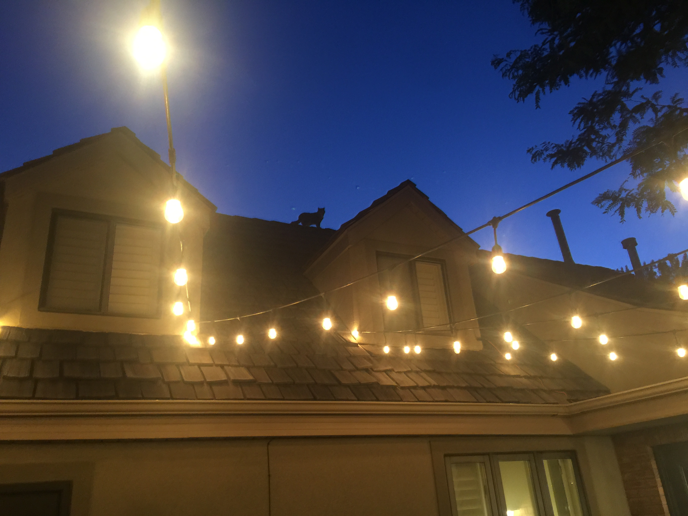

Today marked two months since I started waking up at 5 a.m. For this, I blame my troubled mind that plunged me into a philosophical, almost St. Augustinian contemplation about time. This happened on Wednesday, June 10, when I wrote these three long paragraphs that I’m sharing now if you are interested in accessing the stream of consciousness of someone anxious about time:

_Maybe the solution to my anxiety about time is to extend the time, i.e., change my perception of time. Currently, I’m looking at so many topics, but each day has only 24 hours, and I have to sleep for at least 6, and then there are my work and other things that prevent me from being immersed. On the other hand, there are multiple subjects that I want to learn about and master, but I can only learn so much within a day. I’m anxious about the time because life is short, and the knowledge is infinite. Well, the answer that should chase my anxiety is simple: **I should treat my life and behave as if I was already in eternity.** It should be clear that I speak about the eternity of human life, which I believe in. Of course, if there’s no eternal life for men, time will still continue to flow in eternity. Somehow in our Western culture, we look at time and eternity as two different categories. For most of us, time is something we are living now, while eternity is a higher category where we won’t be limited, and we will have an infinite amount of time. But it seems to me that time is already immersed in eternity, and it’s less dependent on physical laws than on our perception of time. How we act determines our perspective of time. If we treat this life as an earthly business transaction, then yes, we are limited, and there are things in this life more valued than others — so we prioritize to get the most value for our work and existence. But what happens when our goals are spiritual, and we learn things that benefit our soul? The time disappears, and we feel fulfilled._

_Now the main question for me is: **What would I seek to learn first if this moment was the beginning of eternity?** It’s hard to answer this question from the mortal perspective because there are life lessons I have to learn while in mortality. I also have to perform actions that would provide basic elements to sustain my mortal life, such as food, clothing, shelter, healthcare. A logical solution to these limitations would be to dedicate a portion of my life to obtaining enough wealth that would help me focus on the matters of eternity (whatever that might be) for the rest of my life. Life of a missionary is, to an extent, an example of life as eternity. It’s a life isolated from distractions. However, talking to people 9–10 hours a day is maybe not the best way to learn eternal things and gain clarification. With only two hours of study time and 30 minutes of journal time (an hour if you are really organized) it’s hard to crystalize thoughts. Nevertheless, meeting people from different backgrounds is a great way to learn about the human family and see them as God’s children. The current society is structured in a way that forces us to work hard to gain money in order to enjoy things that matter to us._

_After these thoughts on time and eternity, I think I’ve found the most effective solution and answers the question about what I would learn first if this moment was the beginning of eternity. The solution comes from Csikszentmihalyi’s “Flow”. I would learn things that bring the state of flow — the state where the most important thing is the task at hand, and everything else stops mattering. **Maybe that’s what eternity is, a time of deep focus.** This concept then solves the problem of idleness in eternity and justifies the need to be diligent with our thoughts and activities in this life. I think that God wants us to experience eternity, which is possible through mental discipline that results in the state of flow. That’s why prayer and meditation are important. In Islam, for example, praying rituals become flow activities._

With the idea that eternity is a time of deep focus, I decided to get up at 5 am every morning so that I could have more time for concentration and thinking about my messy existence. I agreed with myself that I should have a trial period of 14 days, and after that, evaluate if waking up at 5 a.m. was a terrible decision. I wanted to start the test the next morning, so I wrote: “The test will start immediately, with the first day being Thursday, June 11, 2020.” I must admit, a part of me less concerned about time pointed that it would be better that I wait until Monday, since that’s the day that starts the week and it would be neater and surely more symbolically significant for that day to be the genesis of my new life. I rejected this procrastinating idea.

I woke up next morning at 5 a.m., and surprisingly felt no desire to roll over and ditch the whole plan. I thought: “Today is the day that eternity starts.” However, I faced my first challenge when I naively let our cat, Bobby, out of the house. Megan told me that cats need to adjust to a new environment, and since we moved to that house just a couple days prior, Bobby needed to be supervised when outside. Bobby had more respect for Megan because, in my presence, she climbed the fence and then jumped on the roof. I had to walk around the house, not to lose sight of her as she explored different areas. I felt great relief when she started coming down, but then she jumped into the neighbor’s yard, where I had to chase her as she ran from one car to another. Despite the stress I’ve experienced, I believe it was worth it because I managed to take this epic photo.

After the adventure with Bobby, I took my scriptures and studied diligence for about an hour, and then run four miles, had breakfast, and started working at 8 am. I noticed a significant difference in my productivity. Until then, I’ll admit that it was very convenient to wake up at 7:55 a.m., roll over, grab my laptop, and start working — the blessings of remote work accelerated by COVID-19.

For the rest of the week, I studied diligence and self-mastery and then moved on to study obedience, accountability, consecration, sanctification. Studying these concepts has helped me to live a more ‘eternal’ life and evolve as a person. Whether you are religious or not, the idea of personal evolution is compelling because it pushes you to try new things and despise comfortable existence.

The trial period turned into eight additional weeks of growth and learning.

## What I’ve Read/Listened

During this time from 5 a.m. to 8 a.m., I’ve read fours books:

- _How Will You Measure Your Life?_ by Clayton Christensen
- _Outliers_ by Malcolm Gladwell
- _Talking to Strangers_ by Malcolm Gladwell
- _Flow_ by Mihaly Csikszentmihalyi

Additionally, as part of my winding down at night and preparing for bed, I’ve read Aleksandar Hemon’s Love and Obstacles, and I’m just finishing his The Book of My Lives. All these books have not only enriched my life, but they’ve been essential tools in the current context of dramatic social changes caused by COVID-19 and protests against racial inequality. On that note, if you want to have a better understanding of police and our emotional unintelligence, I strongly recommend Talking to Strangers by Gladwell.

Hemon’s books have helped me understand my position as a Bosnian immigrant in the USA. Hemon has helped me understand the depth of suffering that my parents went through during the war in Bosnia. This is something I want to write about in some of my future posts.

I’ve listened to hours of Jocko Willink’s podcast. Jocko introduced me to the idea of extreme ownership, the idea that leaders must own everything in the world. There’s no one else to blame. He wrote a book about a concept, a book that I’m planning on finishing soon.

## What I Wrote

I kept a detailed journal of all my readings and morning studies, and now I have 82 pages in A4 format filled with knowledge and experiences I have gained over the last two months. I consider myself a reasonably diligent journal keeper, but writing something every day and commenting on things that I read and learn has been a great step towards a clarified mind.

I also finished My Decade project, a series of three articles in which I reflect on my 2010s. I finished the [final article](https://medium.com/@haris.rozajac/my-educational-life-journey-from-bosnia-to-usa-part-3-blessings-8404cd84f52) on July 13.

## Exercise

During my morning runs, I’ve logged 40 miles of running, and I’ve also gotten into high-intensity workouts. I’ve seen my body transform, and I’m very close to running two miles under 12 minutes. This goal is a part of a bigger goal to complete basic Navy SEAL physical screening. Completing basic SEAL physical screening was a part of my New Year’s resolution, along with reading a book every week. Although I’m not finishing a book every week, I’m keeping close to that goal, and averaging on about 4–5 books every 6 weeks.

## Final Thoughts

I don’t want to lie and say that I woke up at 5 a.m. every morning for the last two months. They’ve been times when I slept in until 7 am and once even until 9:30 a.m. Although I don’t have a perfect record, this activity was life-changing and has helped me to be more productive, avoid mediocrity, reduce worrying about time, and above all — live a more abundant life. Ultimately, on July 25, I’ve received an answer to the question that started this whole project, the question of conquering time and feeling eternity. It was Saturday, and I spent that day seemingly terribly unproductive, playing Pro Evolution Soccer (PES) 2010 almost the whole day. This is the video game my brother and I played ten years ago. We bonded and had so much fun. So, when I finally found this game, I was taken back to that moment of pure, childish joy, and I didn’t want it to stop. Once I eventually turned off my computer, the answer came to me:

_When you are dedicated to diligence — in thinking, writing, learning — you will feel that the time has slowed down, you will feel the eternity. Unfortunately, I see many people wasting time and, in return, not feeling eternity but anxiety. They get old and look back at their lives with sadness. Even if they had a good life, they feel sad that those good days are gone, and ahead of them is less time and inevitable death._

_I’ve learned that it is possible to slow down time and see things from an eternal perspective. As I read, prayed, and pondered, and as I played PES whole day today, I was able to compare and contrast the diligence of mind (getting up early, constantly learning and refining my thinking) with the numbness of mind (playing PES all day, spending time unnecessarily on social media, gossiping). It took me 45 days to reach these conclusions. I understand that to some, these principles are common knowledge — but how many of them have applied and followed these principles. My goal is to continue conquering time and reach the clearness of eternal bonds._
